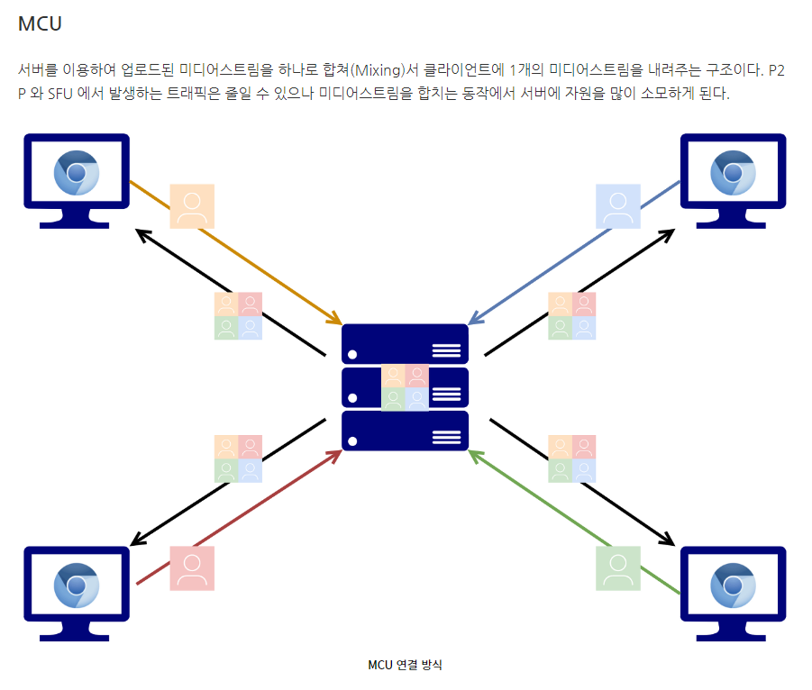
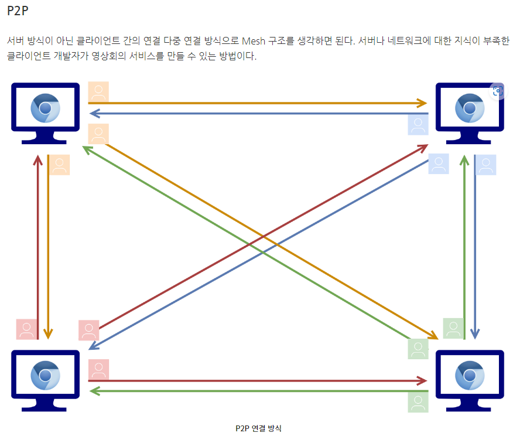
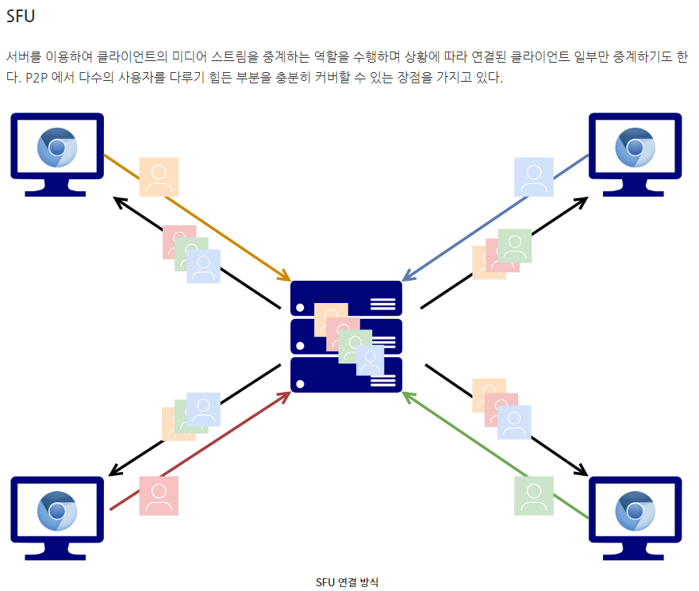
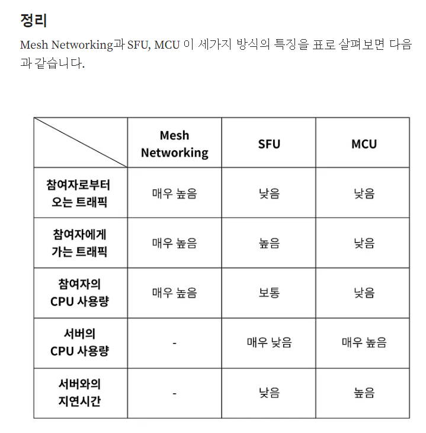

# janus

> WebRTC(Real-Time Communication) 기반의 오픈소스 미디어 서버입니다. WebRTC는 웹 브라우저나 모바일 앱에서 실시간 오디오, 비디오 및 데이터를 교환하는 기술로, 영상 통화, 화상 회의, 실시간 스트리밍, P2P 파일 공유 등 다양한 실시간 통신 애플리케이션에서 사용됩니다.

## 1:1 
> 1:1 방식의 구현은 janus 오픈 소스를 이용하지 않더라도 WebRTC 프로토콜을 이용해 구현할 수 있습니다.

## N:N (ZOOM,Azar)

> 그룹 비디오콜의 구현 방식 탐색  
### 1. MCU   

중앙 서버가 각 유저가 보내는 미디어 스트림을 인코딩 하여 처리하기에는 많은 비용과 인프라가 요구되기 때문에 적합하지 않습니다.

   
### 2. MESH (P2P)

최대 8명의 유저가 서로 full mesh 방식으로 연결하여 영상을 주고 받는 구조를 사용
중앙 서버가 존재하지 않기 때문에 트래픽 비용을 낼 필요가 없습니다. 
단, 모든 상대에 대해 별도로 영상을 인코딩/ 전송 해야 하기 때문에 모바일에서는 사용하기 어려운 구조입니다.

### 3. SFU 

SFU 구조는 현재 ZOOM에서도 사용하는 방식으로 각 서버에서 미디어 가공 과정을 거치지 않고 그대로 다른 사용자에게 전달만 하기 때문에 상대적으로 부하가 MCU 보다 적게 요구 됩니다.
현재 ZOOM에서도 이 방법을 이용해 1000명의 그룹콜을 할 수 있다고 알려져 있습니다.

### 비교 표
> SFU, MCU, Mesh는 모두 실시간 통신에서 사용되는 다양한 미디어 서버 및 네트워크 토폴로지 카테고리를 나타냅니다.
토폴로지란 컴퓨터 네트워크의 요소들(링크, 노드 등)을 물리적으로 연결해 놓은 것, 또는 그 연결 방식입니다.

## 1:N 
> 현재 재직중인 회사에서 개발하고 있는 모델입니다.

### HLS 
> 전통적인 방식이고, 구현 난이도 낮다. 단점으로는 latency가 있기 때문에 최대 30초까지 걸릴 수 있습니다.

### WebRTC
> HLS의 단점을 보안하기 위해서 사용하는 프로토콜인 WebRTC 입니다.
janus의 streaming plugin과 자사 프로그램을 이용해 사용자가 전달한 미디어 스트림을 origin -> relay -> edge로 전달하는 방식으로 최소한의 서버로 많은 사용자를 수용할 수 있게 개발단계에 있습니다.

출처 : image 폴더 안에 있습니다.!